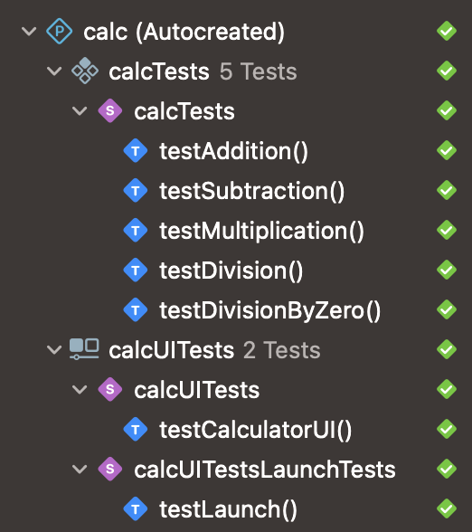

# **SwiftCalc - A SwiftUI-Powered Calculator** 📲  

  [](https://github.com/cdasilvasantos/calc-is322/actions/workflows/main.yml)

## 🔹 **About SwiftCalc**  
**SwiftCalc** is a sleek and efficient **SwiftUI-based calculator** designed for **iOS**. This project focuses on clean architecture, intuitive user experience, and comprehensive testing.  

### **Key Highlights**  
✔ **Elegant SwiftUI Interface**  
✔ **Essential and Advanced Calculator Functions**  
✔ **Comprehensive Unit & UI Testing with XCTest**  
✔ **Optimized for Accessibility & Usability**  

---

## 🎯 **Features at a Glance**  
📌 **User-Friendly Interface** – Simple, minimal, and effective  
➕➖✖➗ **Basic Operations** – Addition, subtraction, multiplication, and division  
🔢 **Extended Functions** – Percentage, decimal point, sign toggle  
🧼 **Memory Management** – Clear and delete functions  
📜 **Equation History** – Displays past calculations for better tracking  
🛡 **Reliable Testing Suite** – Built-in unit and UI tests for stability  
♿ **Accessibility Support** – Enhanced UI testing compatibility  

---

## 🛠 **Getting Started**  

### **1️⃣ Clone the Repository**  
```sh
git clone https://github.com/cdasilvasantos/calc-is322.git
cd calc-is322
```

### **2️⃣ Open in Xcode**  
```sh
open calc-is322.xcodeproj
```

### **3️⃣ Build & Run the App**  
- Open the project in Xcode  
- Press **Cmd + R** to build and launch the app  
- Select an **iOS Simulator** or a **physical device**  

### **4️⃣ Running Tests**  
- Press **Cmd + U** in Xcode to execute all unit and UI tests  
- Check results in the **Test Navigator**  

---

## 🏗 **App Architecture**  

SwiftCalc follows a clean and maintainable structure:  

🔹 **`ContentView.swift`** – Core UI & interaction logic  
🔹 **`CalculatorButton.swift`** – Defines calculator buttons and properties  
🔹 **`CalculatorButtonView.swift`** – Custom UI components for button interactions  

### **User Interface Design**  
🎨 **Modern Dark Theme** – Sleek aesthetics with vibrant highlights  
📱 **Responsive Layout** – Optimized for different screen sizes  
🔘 **Tactile Feedback** – Circular buttons with smooth animations  

---

## ✅ **Testing Approach**  

**Unit Tests**  
✔ Validate all calculation operations  
✔ Ensure number formatting accuracy  

**UI Tests**  
✔ Simulate user interactions  
✔ Verify correct display of results  
✔ Test different calculation flows  

**All Tests Pass**



---

## 🎥 **App Preview**  
  

---

## 📖 **Project Presentation**  
This project was showcased for **IS 322 – Mobile Applications and Design**. You can check out the slides here:  
📌 [View the Presentation](https://docs.google.com/presentation/d/1HatUgaseFliKZSVUwOK7ubOC9M3Ck_9KMhcx_teFtCo/edit?usp=sharing)  

---

## 🎨 **Figma Prototype**  
The calculator’s UI was initially designed in **Figma**. You can explore the design here:  
🔗 [View Figma Prototype](https://www.figma.com/design/IVVOKyn94TETe67m9VWhaW/Iphone-Calculator-(Community)?node-id=0-1&t=hRt2vtLw9T0NKay4-1)  

---

## 🛠 **Tech Stack & Design Principles**  

### **Technologies Used**  
🚀 **SwiftUI** – Declarative UI framework  
🧪 **XCTest** – Comprehensive testing support  
🔍 **Accessibility Tools** – Enhanced support for assistive technologies  

### **Design Principles**  
✔ **Clean Code Structure** – Organized for scalability  
✔ **Separation of Concerns** – UI components and logic are modularized  
✔ **Maintainability & Testability** – Designed with easy debugging in mind  

---

## ✨ **Creator**  
Developed by **Chiara da Silva Santos** 🚀  
🔗 [GitHub](https://github.com/cdasilvasantos)  
